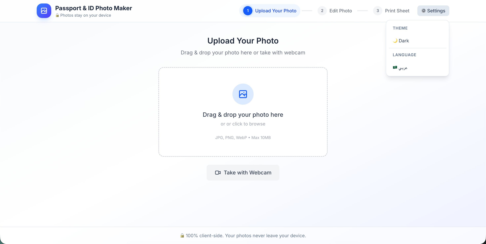
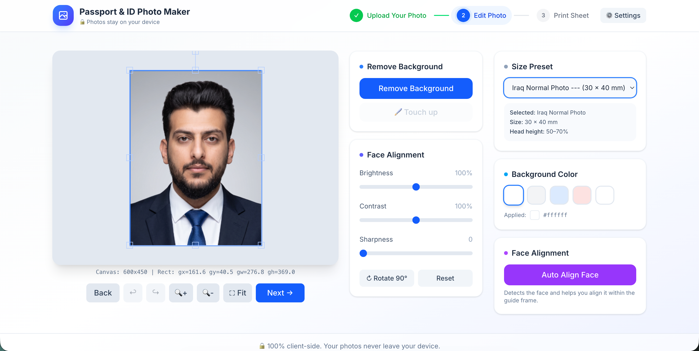
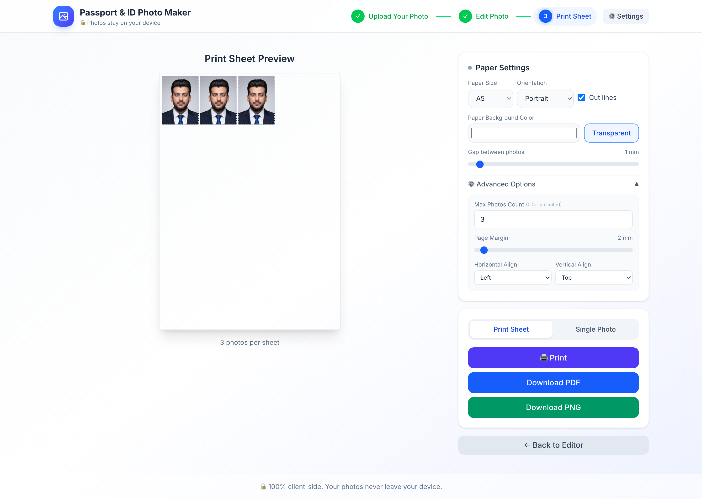

<div align="center">
  

  # Passport & ID Photo Maker

  **A modern, browser-based AI tool to create perfect passport, visa, and ID photos from the comfort of your home.**

  [](https://reactjs.org/) [](https://vitejs.dev/) [](https://tailwindcss.com/) [](https://opensource.org/licenses/MIT)

  [Repo Github](https://github.com/waadmawlood/Passport-ID-Photo-Maker-Web-App)
</div>

---

## 🌟 Introduction

The **Passport & ID Photo Maker** is a completely free and open-source web application designed to save you time and money. Simply upload a selfie, and let our entirely client-side AI automatically remove the background and align your face according to international government standards. Generate print-ready PDF sheets in seconds—all without your photos ever leaving your device!

---

## 📸 Screenshots

<div align="center">
  
  
  
</div>

---

## ✨ Features

- **🔒 100% Privacy & Local AI**: Background removal (`@imgly/background-removal`) runs entirely in your browser using ONNX Web Runtime. Your photos are never uploaded to a server.
- **✂️ Auto Face Alignment**: Automatically detects facial landmarks to center and scale your head perfectly within the official guide limits.
- **🌍 Global Standards**: Includes a vast library of official sizes (e.g., US Visa, Schengen, UK, Iraq Passport).
- **🖨️ Smart Print Layouts**: Generate ready-to-print sheets (A4, A5, 4x6, 5x7) with adjustable photo gaps, cut lines, and background colors.
- **🌐 Bilingual**: Full RTL/LTR support with English and Arabic translations.
- **💾 Auto-Save**: Your language preferences, paper settings, and default presets are saved automatically to your local storage.

---

## 🗺️ Roadmap

We are constantly improving the app! Here is our current progress and what we have planned for the future:

### ✅ Completed
- [x] Client-side AI Background Removal
- [x] Auto Face Alignment & Scaling
- [x] Custom Background Color Picker (with transparency detection)
- [x] Interactive Photo Touch-up Brush (Erase/Restore)
- [x] Multi-format Print Sheet Generator (PDF/PNG/Print dialog)
- [x] English & Arabic Localization
- [x] Local Storage Persistence

### 🚀 Upcoming Features (Ideas & Suggestions)
- [ ] **👔 AI Formal Clothes Swap**: Automatically generate and fit formal wear (suits, ties, blouses) onto the user to make casual selfies instantly professional!
- [ ] **✨ AI Lighting & Skin Retouching**: Subtle auto-correction for harsh shadows and skin blemishes to meet official document requirements.
- [ ] **🗂️ Batch Processing**: Upload photos of an entire family and process them all into a single print sheet simultaneously.
- [ ] **☁️ Cloud Export Integrations**: Save final print sheets directly to Google Drive, Dropbox, or email them.
- [ ] **📱 PWA Support**: Install the app directly on your phone or desktop for offline use.

---

## 🛠️ Tech Stack

- **Framework**: [React 18](https://react.dev/) + [Vite](https://vitejs.dev/)
- **Styling**: [Tailwind CSS](https://tailwindcss.com/)
- **Canvas/Image Manipulation**: [Fabric.js v7](http://fabricjs.com/)
- **AI Background Removal**: [@imgly/background-removal](https://img.ly/showcases/cesdk/web/background-removal/web)
- **PDF Generation**: [jsPDF](https://parall.ax/products/jspdf)

---

## 🚀 Quick Start

To run this project locally:

1. **Clone the repository:**
   ```bash
   git clone https://github.com/waadmawlood/Passport-ID-Photo-Maker-Web-App.git
   cd Passport-ID-Photo-Maker-Web-App
   ```

2. **Install dependencies:**
   ```bash
   npm install
   ```

3. **Start the development server:**
   ```bash
   npm run dev
   ```

4. **Open in browser:**
   Navigate to `http://localhost:5173`

---

## 🤝 Contributing

Contributions are what make the open-source community such an amazing place to learn, inspire, and create. Any contributions you make are **greatly appreciated**!

1. Fork the Project
2. Create your Feature Branch (`git checkout -b feature/AmazingFeature`)
3. Commit your Changes (`git commit -m 'Add some AmazingFeature'`)
4. Push to the Branch (`git push origin feature/AmazingFeature`)
5. Open a Pull Request

---

## 📄 License

Distributed under the MIT License. See `LICENSE` for more information.
